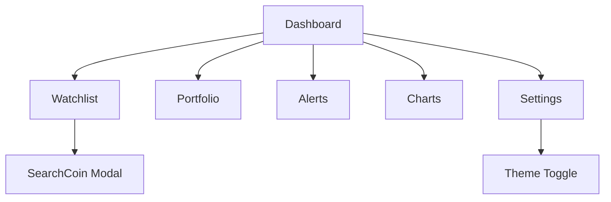

# Crypto Monitor Extension UI Redesign Plan

## Design System

### Color Scheme
- **Light Theme**:
  - Background: `#FFFFFF` to `#F7F9FC` gradient
  - Text: `#1A202C` (primary), `#4A5568` (secondary)
  - Accent: `#4299E1` (blue), `#9F7AEA` (purple)
  - Success: `#48BB78`, Error: `#F56565`

- **Dark Theme**:
  - Background: `#1A202C` to `#2D3748` gradient
  - Text: `#F7FAFC` (primary), `#E2E8F0` (secondary)
  - Accent: `#63B3ED` (blue), `#B794F4` (purple)
  - Success: `#68D391`, Error: `#FC8181`

### Typography
- Font Family: `Inter` (Google Fonts)
- Scale: 12px (small), 14px (base), 16px (medium), 18px (large), 24px (xl), 32px (xxl)
- Weights: 400 (regular), 500 (medium), 600 (semibold), 700 (bold)

### Spacing
- Base unit: 4px (0.25rem)
- Scale: 4, 8, 12, 16, 20, 24, 32, 40, 48, 64, 80, 96, 128px

### Shadows
- sm: `0 1px 2px 0 rgba(0, 0, 0, 0.05)`
- md: `0 4px 6px -1px rgba(0, 0, 0, 0.1)`
- lg: `0 10px 15px -3px rgba(0, 0, 0, 0.1)`
- xl: `0 20px 25px -5px rgba(0, 0, 0, 0.1)`

## Component Redesigns

### Dashboard
- **Layout**: Vertical navigation with tab buttons on the left, content area on the right
- **Header**: Logo, title, and user actions (settings, theme toggle)
- **Navigation**: Icon + label for each tab, active state with accent color
- **Content Area**: Scrollable with consistent padding

### Watchlist
- **Coin Cards**:
  - Layout: Image, name/symbol, price, 24h change, actions
  - Hover: Lift effect with shadow
  - Price change: Color-coded (green/red) with icon
- **Empty State**: Illustrated message with CTA to add coins

### SearchCoin Modal
- **Overlay**: Semi-transparent backdrop with blur
- **Modal**: Centered card with search input, results list, and actions
- **Results**: Coin icon, name, symbol, and add button

### Settings
- **Sections**: Grouped settings with clear labels
- **Controls**: Styled select dropdowns, toggle switches, buttons
- **Theme Toggle**: Animated switch with moon/sun icons

## Implementation Approach

1. **Setup**:
   - Add Inter font via Google Fonts
   - Update Tailwind config with design system
   - Create utility classes for common patterns

2. **Component Updates**:
   - Dashboard: Restructure layout, add navigation
   - Watchlist: Redesign coin cards, add empty state
   - SearchCoin: Improve modal styling and UX
   - Settings: Enhance controls and layout

3. **Animations**:
   - Use Framer Motion for micro-interactions
   - Add transitions for theme changes
   - Implement loading states

4. **Accessibility**:
   - Ensure proper contrast ratios
   - Add focus states for keyboard navigation
   - Implement ARIA attributes

## Wireframes

## Timeline
- Design System: 1 day
- Component Redesigns: 3 days
- Implementation: 5 days
- Testing & Refinement: 2 days

## Tools
- **Design**: Figma for mockups
- **Development**: Tailwind CSS, Framer Motion
- **Testing**: Chrome DevTools, Storybook